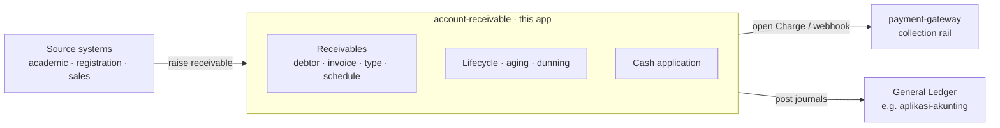

# account-receivable

Generic Accounts Receivable management — the **subledger** that tracks what is owed and by whom,
collects it through a payment rail, and posts the resulting entries to a general ledger.

It sits between collection and the book of record:

## What it is

AR is an operational receivables subledger. It owns the *detail*: debtors, invoices (with line
items), invoice/bill types, installment schedules, the receivable lifecycle (open → partially paid
→ paid → overdue → written off), aging, statements, dunning, and cash application. It delegates the
*money movement* to a payment gateway and the *book of record* to a general ledger.

It is a generic product, not a campus billing app. A specific deployment (e.g. a university) feeds
receivables in and supplies notification/report specifics through a thin integration layer — it is
not baked into the engine.

## What it is NOT

- **Not a general ledger.** Double-entry book of record, chart of accounts, and financial
  statements live in the GL. AR posts journals to it and holds no statements.
- **Not a payment gateway.** VA numbers, bank adapters, and settlement are the gateway's job. AR
  consumes the gateway to collect, sending the debtor and a bill-category slot; the gateway
  allocates the number in each bank's layout. (Not yet true of the code: AR still computes the
  number from its own layout config until issue #1 lands.)
- **Not a billing/academic system.** Where receivables come from (course enrolment, fees, terms)
  is the source system's concern.

## Integrations

- **Collection** — AR is a *consumer* of [payment-gateway](../payment-gateway): it opens a `Charge`
  per receivable (or per installment), receives the payment webhook, and applies the cash. Charge
  types `CLOSED` / `INSTALLMENT` / `OPEN` map to receivable kinds.
- **General ledger** — AR posts double-entry journals to a GL via API (reference GL:
  `aplikasi-akunting`): invoice issued → *Dr A/R · Cr Revenue*; receipt → *Dr Cash · Cr A/R*;
  write-off → *Dr Bad Debt · Cr A/R*. The GL keeps only the **A/R control account**; AR keeps the
  per-debtor detail.

## Reconciliation (this app's two layers)

1. **Cash application** — gateway payments ↔ receivables: every collected amount lands on a
   receivable.
2. **Subledger ↔ GL** — AR subledger total ↔ the GL's A/R control-account balance: the books tie out.

(Bank settlement ↔ gateway payments is the gateway's reconciliation, not this app's.)

## Stack

Spring Boot 4 · Java 25 · PostgreSQL 18 + Flyway · Thymeleaf + HTMX + Tailwind (admin) ·
Testcontainers + RestAssured + Playwright (tests). Namespace `com.artivisi.accountreceivable`.

## Status

Greenfield. See `CLAUDE.md` for architecture, the subledger↔GL boundary, prior-art repos to mine,
and the build sequence.

## License

Apache 2.0 — uniform with the rest of the Artivisi product line (decided 2026-07-03).
