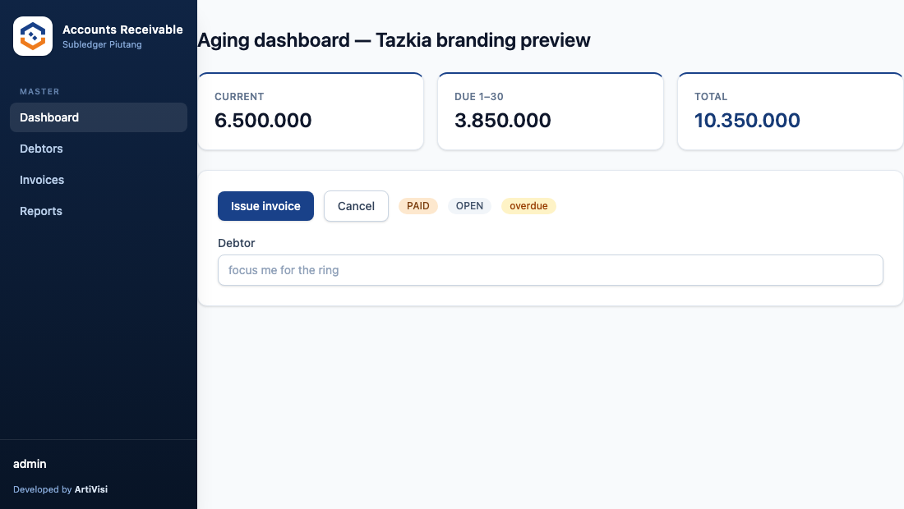

# Tazkia branding for account-receivable

Deploy-time branding overlay for the **account-receivable** admin UI. It re-themes the app to
Tazkia colors and logo **without rebuilding** — the engine ships a neutral default logo + an empty
`branding.css`; this overlay shadows them at runtime.

> This is a **deployment overlay**, isolated under `deploy/tazkia/` and never wired into the engine
> build. The engine itself stays deployment-neutral (generic logo + empty `branding.css` under
> `src/main/resources/static/`); this directory only carries Tazkia-specific overrides applied at
> runtime. Other deployments get their own `deploy/<name>/` sibling.



## What's here

```
branding/
  css/branding.css   # Tailwind theme-variable overrides → Tazkia palette (blue #194189 / orange #EE7B1D)
  img/logo.svg       # Tazkia emblem (logo-tazkia-group, mark only — no wordmark); sidebar + login
```

Palette is derived from the Tazkia institutional logo: primary **#194189** (blue), accent
**#EE7B1D** (orange). Primary recolors the sidebar rail, buttons, links, focus rings and key
figures; accent recolors success badges (PAID / ACTIVE / SENT), highlights and success flash notices.

## How to wire it (Spring Boot)

Serve this `branding/` directory from an external static location listed **before**
`classpath:/static/`, so its `css/branding.css` and `img/logo.svg` shadow the engine defaults:

```properties
# application.properties / env
spring.web.resources.static-locations=file:/opt/ar/branding/,classpath:/static/
```

Environment-variable form (e.g. in the container):

```
SPRING_WEB_RESOURCES_STATIC_LOCATIONS=file:/opt/ar/branding/,classpath:/static/
```

Docker example — mount the bundle and point the property at it:

```yaml
services:
  account-receivable:
    image: account-receivable:latest
    environment:
      SPRING_WEB_RESOURCES_STATIC_LOCATIONS: file:/opt/ar/branding/,classpath:/static/
    volumes:
      - ./branding:/opt/ar/branding:ro
```

Notes:
- The external path **must end with `/`** and be listed **first**; classpath stays last as the
  fallback for everything else (`app.css`, `htmx.min.js`, …).
- No rebuild needed. Changing `branding.css` or `logo.svg` and restarting is enough. (Set a short
  cache TTL or bust the cache if you iterate on the palette.)

## Logo

- The logo renders inside a **square white chip** in the sidebar (48px) and at ~56px on the login
  screen, via `object-contain`. A **square emblem (mark only, no wordmark)** fits best.
- Included default is `logo-tazkia-group.svg` — the Tazkia emblem alone (1:1, no institution text),
  universal across entities. Alternatives from the institution's logo set:
  `logo-universitas-tazkia.svg` (emblem + "Universitas Tazkia" wordmark, ≈500×460) or
  `logo-stmik-tazkia.svg` (tall 280×480 — will letterbox small). Swap `branding/img/logo.svg` if you
  need a specific entity's mark.

## Verify

1. Start the app with the property set.
2. Open `/login` → the Tazkia logo shows above the form; "Developed by ArtiVisi" in the footer.
3. Sign in → the sidebar rail is Tazkia blue, "Issue invoice"/primary buttons are blue, success
   badges (PAID/ACTIVE/SENT) are Tazkia orange.
4. If colors don't change: confirm `GET /css/branding.css` returns **this** file (not the engine's
   empty one) — i.e. the external location is first in `static-locations` and the path is correct.

## How it works

The engine's Tailwind build emits theme colors as CSS variables on `:root`
(`--color-primary-600`, …) and every utility/component references them via `var(...)`. The engine
links `app.css` then `branding.css`; this file redefines those variables on `:root`, so the later
declaration wins and the whole UI re-themes. Nothing in the engine changes.
