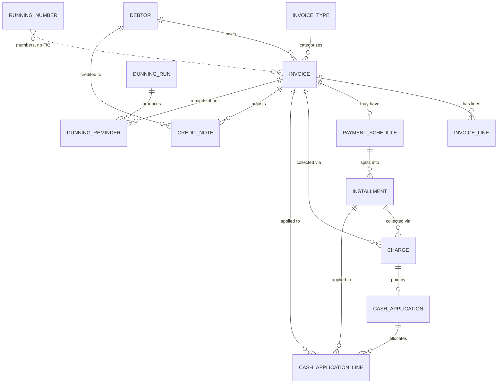

# account-receivable — Domain Model & ERD

Field-level model behind `IMPLEMENTATION-PLAN.md` §3. Reflects all design decisions (codes
resolved at runtime, one CLOSED charge per installment, derived overdue, full write-off only,
single-currency-with-column, polymorphic invoice/installment targets via nullable FKs + CHECK).

## Conventions

- Every table extends **BaseEntity**: `id varchar(36)` (`@UuidGenerator` PK), `created_at`,
  `updated_at` (`timestamptz`), `created_by`, `updated_by` (`varchar`).
- Money: `numeric(19,2)` (`BigDecimal`). Currency: `varchar(3)` default `IDR` (single-currency in
  logic for v1; column present for later).
- Enums: `varchar` + `@Enumerated(STRING)`. FKs prefixed `id_`.
- "Polymorphic target" = two nullable FKs (`id_invoice`, `id_installment`) + CHECK that **exactly
  one** is set. Used by `charge` and `cash_application_line`.

## ERD (relationships)

`JOURNAL_POSTING` has a **polymorphic source** (`source_type` + `source_id`) — no FK, it points at
an invoice / cash_application / write-off event / credit_note.

## Registries

**debtor** — `code` UNIQUE · `name` · `email` · `phone` · `status` (ACTIVE/INACTIVE)

**invoice_type** — `code` UNIQUE · `name` · `active`

**running_number** — `prefix` UNIQUE · `last_number bigint` · `document_type`
  (INVOICE / CREDIT_NOTE; allocation row-locked in a service)

## Receivables

**invoice** — `invoice_number` UNIQUE · `id_debtor` · `id_invoice_type` · `issue_date` ·
  `due_date` · `currency` · `amount` · `outstanding` · `payment_status`
  (OPEN/PARTIALLY_PAID/PAID/WRITTEN_OFF) · `is_installment bool` · `description`
  — *overdue is derived* (`due_date < today AND outstanding > 0`), not stored.

**invoice_line** — `id_invoice` · `line_no` · `description` · `quantity` · `unit_amount` ·
  `line_amount` (= qty × unit). Invariant: Σ line_amount = invoice.amount at issue; immutable after.

**payment_schedule** — `id_invoice` (1:1, only when `is_installment`) · `installment_count`

**installment** — `id_schedule` · `sequence` · `due_date` · `amount` · `outstanding` ·
  `payment_status`. Invariant: Σ installment.amount = invoice.amount.

`outstanding` is **stored** at both invoice and installment level, kept consistent inside the
cash-application / credit-note / write-off transaction (invoice.outstanding = Σ installment.outstanding
for installment invoices).

## Collection (gateway consumer)

**charge** — `gateway_charge_id` · `consumer_reference` UNIQUE · `charge_type` (CLOSED v1) ·
  `id_invoice?` · `id_installment?` (exactly one) · `amount` · `currency` · `status`
  (ACTIVE/PARTIALLY_PAID/PAID/EXPIRED/CANCELLED) · `cumulative_paid` · `escrow_code` · `va_number`
  · `expires_at`. (Single VA per charge in v1; multi-VA → child table later.)

**cash_application** — `gateway_payment_reference` UNIQUE (idempotency) · `id_charge?` · `amount` ·
  `currency` · `received_at` · `status` (UNAPPLIED/PARTIALLY_APPLIED/APPLIED/REVERSED) · `note`.
  An ambiguous payment is persisted UNAPPLIED with no lines, surfaced for review.

**cash_application_line** — `id_cash_application` · `id_invoice?` · `id_installment?`
  (exactly one) · `allocated_amount`. Invariant: Σ allocated_amount ≤ cash_application.amount.

## Corrections

**credit_note** — `credit_note_number` UNIQUE · `id_debtor` · `id_invoice` (adjusted) ·
  `issue_date` · `amount` · `reason` · `status` (ISSUED/POSTED). Reduces invoice.outstanding;
  posts a reversing journal. (Write-off is *not* a document — it is a `payment_status` flip; see
  plan §3.)

## GL posting (out of scope — removed)

AR does not post to any GL. Every organization's GL is different (SaaS, desktop, spreadsheets,
homemade), so journal export is the job of a thin per-organization batch bridge OUTSIDE this
product. AR's source tables (invoice, cash_application, credit_note, reversal rows) are immutable
or append-only, so a bridge derives journals incrementally by timestamp at whatever summarization
level the target GL wants, and owns its own posted-state ledger.

## Dunning (+ reconciliation note)

**dunning_run** — `run_date` · `criteria` · `status` (RUNNING/DONE) · `total_reminders`

**dunning_reminder** — `id_dunning_run` · `id_invoice` · `channel` (EMAIL/SMS — SPI-resolved) ·
  `recipient` · `status` (PENDING/SENT/ERROR) · `sent_at?` · `error?`

Reconciliation (deferred): no `reconciliation_run`/`reconciliation_discrepancy` engine is built.
The gateway's own reconciliation is the money-loss control on the collection side. An AR ↔ GL
tie-out (outstanding total vs A/R control balance) belongs to the per-organization GL bridge.

## Bulk upload (tracking)

**bulk_upload_batch** — `filename` · `uploaded_at` · `total_rows` · `success_count` ·
  `error_count` · `status`
**bulk_upload_error** — `id_batch` · `line_no` · `message` (fail-loud per-row report)

## Auth (separate schema, self-contained OAuth2)

Spring Authorization Server tables (registered clients, authorizations, consents) + an app
`user` / `role` model for form login. Kept in its own Flyway migration, **not** part of the AR
domain ERD above.

## Cross-cutting invariants

1. Issued invoice amounts immutable — corrections only via credit_note or full write-off.
2. Σ invoice_line = invoice.amount; Σ installment = invoice.amount.
3. Journal balancing is the GL template's responsibility (AR posts templateId + amount); AR never
   posts unbalanced legs because it posts no legs.
4. cash_application idempotent on gateway_payment_reference; charge idempotent on consumer_reference.
5. Money never dropped — journal_posting retries to POSTED or terminal FAILED (surfaced), never lost.
