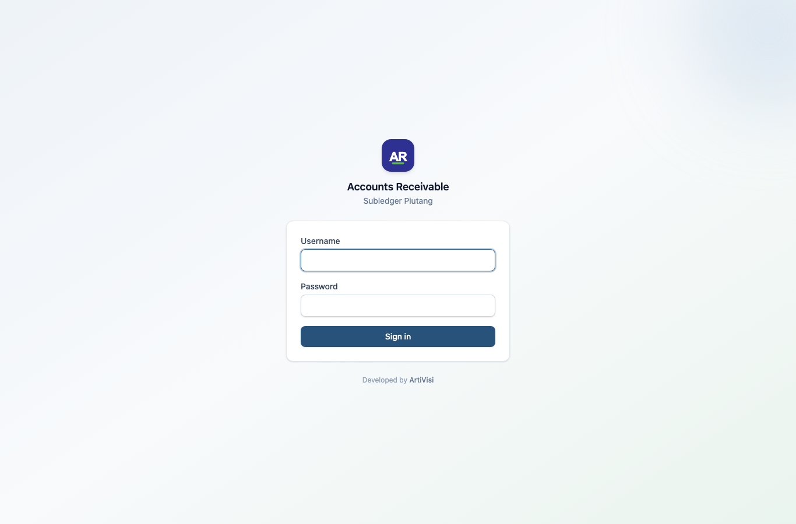
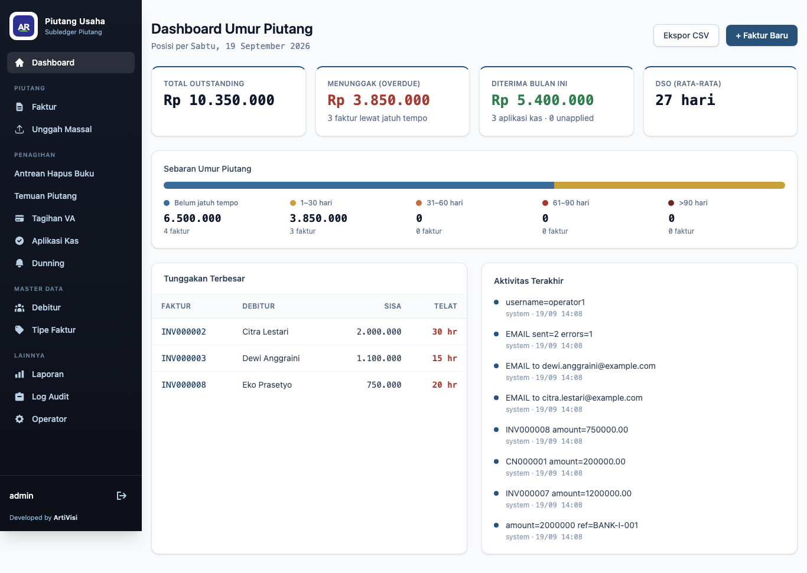

# 1. Pendahuluan & Navigasi

## Masuk (login)

Aplikasi AR memakai form login Spring Security. Buka `/login`, isi **username** dan **password**,
lalu klik **Sign in**.

Pengguna admin awal dibuat otomatis saat aplikasi pertama kali dijalankan, dari konfigurasi
`ar.admin.username` / `ar.admin.password`. Pengguna tambahan dikelola di menu
[Operators](07-audit-operator.md) (khusus peran ADMIN).

Jika kredensial salah, muncul pesan "Invalid username or password." Setelah logout, tampil
pemberitahuan "You have been signed out."

## Peran pengguna

| Peran | Akses |
|-------|-------|
| `ADMIN` | seluruh menu, termasuk **Operators** (manajemen pengguna) |
| `OPERATOR` | seluruh menu operasional kecuali manajemen pengguna |

## Navigasi

Bilah navigasi berupa **panel samping kiri** (sidebar) yang tampil di setiap halaman. Logo dan nama
aplikasi berada di atas; menu dikelompokkan agar mudah ditemukan:

- **Dashboard**
- **Master** — Debtors, Types
- **Piutang** — Invoices, Charges, Dunning
- **Keuangan** — Reports
- **Sistem** — Audit, Operators (hanya ADMIN)

Nama pengguna yang sedang masuk dan tombol **Logout** berada di bagian bawah panel. Logo bersifat
per-deployment (lihat [README](README.md)); ArtiVisi tercantum sebagai *Developed by* di kaki panel.

## Dashboard umur piutang

Halaman awal setelah login adalah dashboard umur piutang (*aging*): ringkasan total tunggakan
dikelompokkan per rentang jatuh tempo.

Setiap kartu adalah satu *bucket* umur, dengan jumlah nominal dan banyaknya kewajiban:

| Bucket | Arti |
|--------|------|
| `CURRENT` | belum jatuh tempo |
| `DUE_1_30` | menunggak 1–30 hari |
| `DUE_31_60` | menunggak 31–60 hari |
| `DUE_61_90` | menunggak 61–90 hari |
| `DUE_90_PLUS` | menunggak lebih dari 90 hari |

Pada data contoh, `CURRENT` berisi 6.500.000 (4 kewajiban) dan `DUE_1_30` berisi 3.850.000
(3 kewajiban), dengan **Total outstanding** 10.350.000. Umur piutang bersifat **turunan** —
dihitung dari `dueDate` dan sisa `outstanding`, bukan status yang disimpan. Sebuah faktur bisa
sekaligus *partially paid* dan *overdue* (lihat INV000003).
</content>
