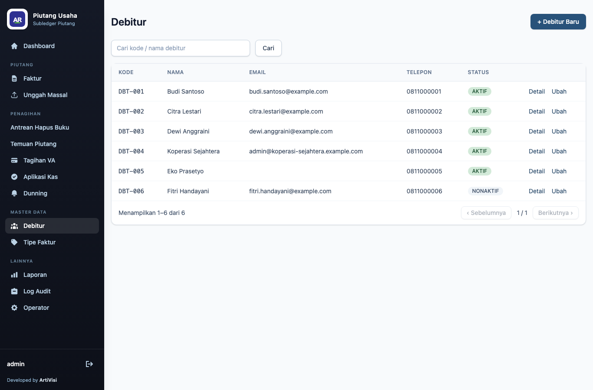
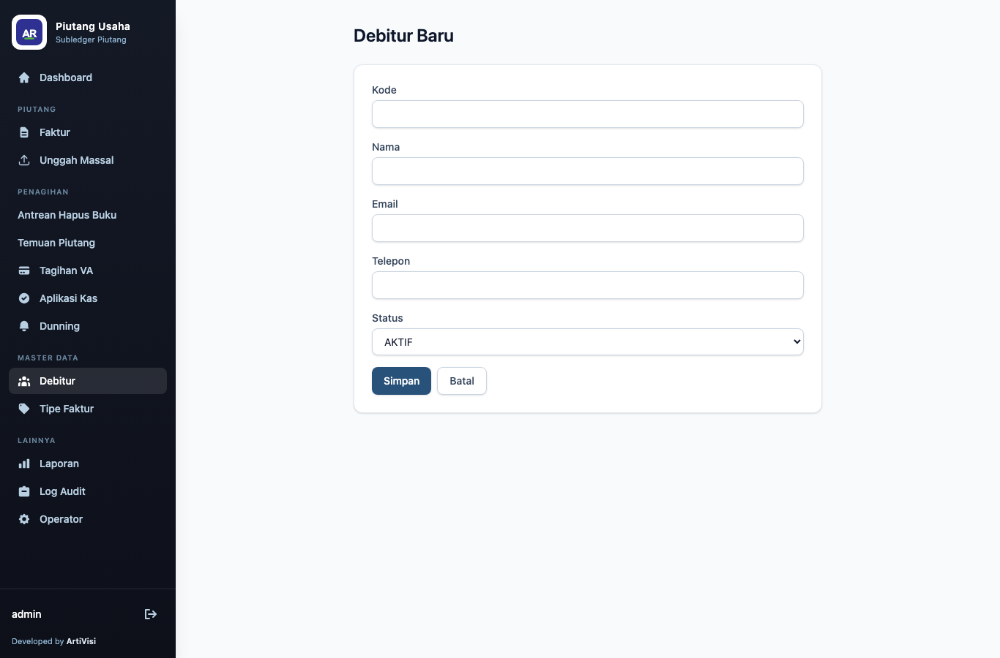
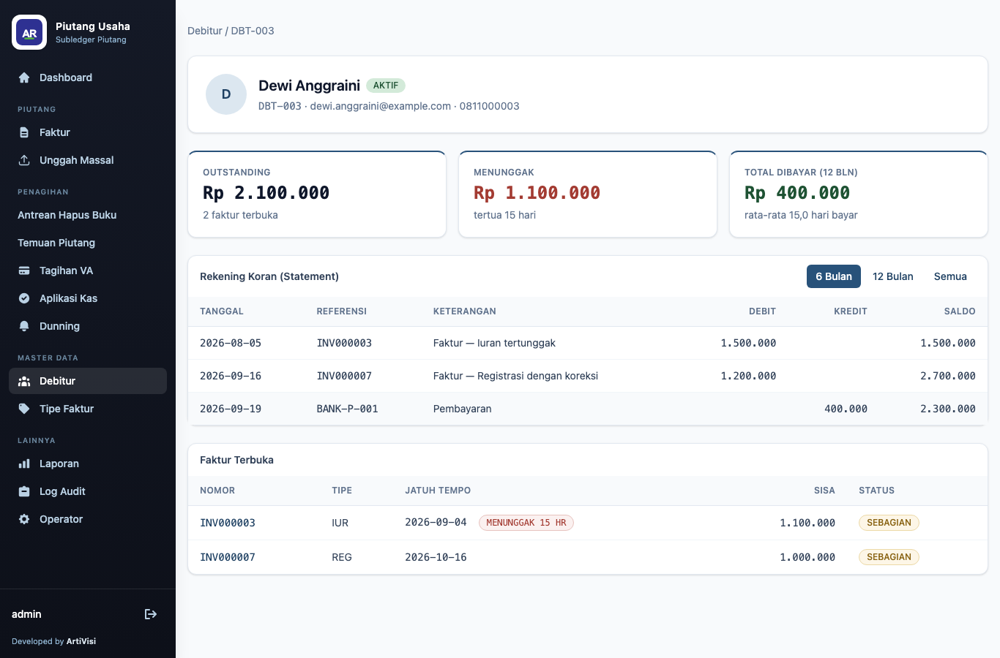
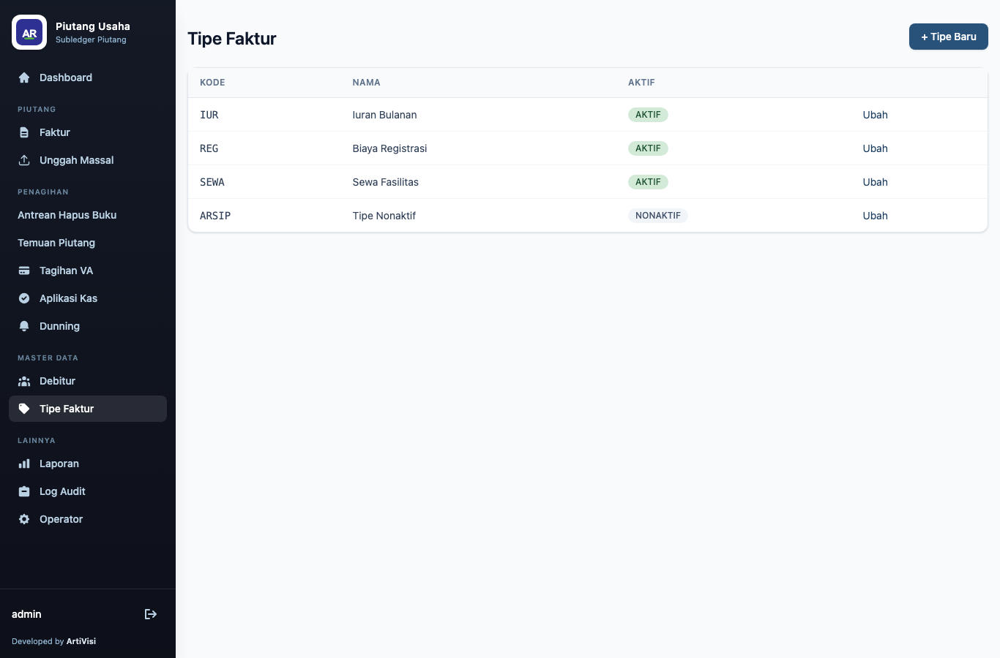
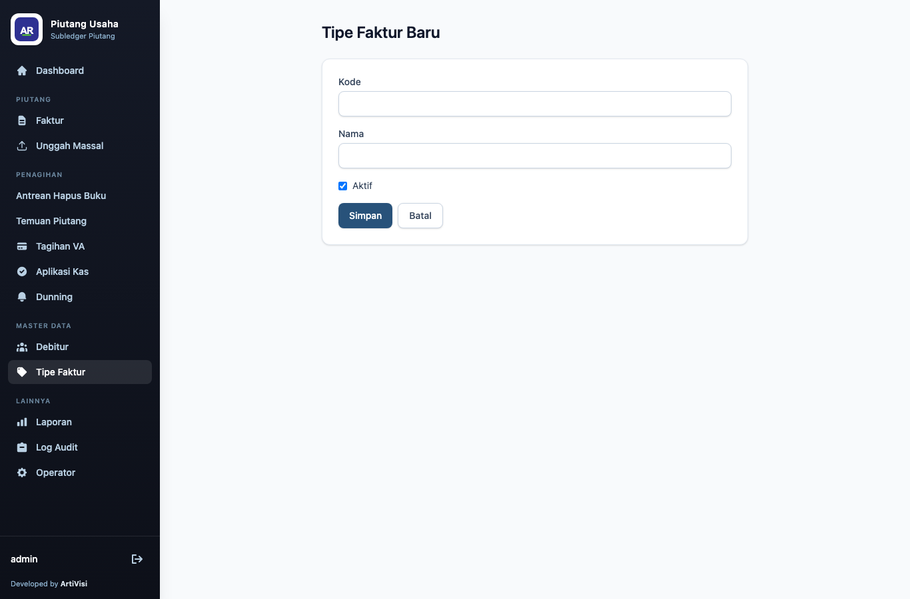

# 2. Master Data

## Debitur

Debitur adalah pihak yang berutang (pelanggan/pembayar). Menu **Debitur** menampilkan seluruh
debitur beserta kode, nama, email, telepon, dan status.

Status `AKTIF` ditandai badge hijau, `NONAKTIF` badge abu-abu (lihat DBT-006). Hanya debitur
`AKTIF` yang muncul di pilihan saat menerbitkan faktur.

### Menambah / mengubah debitur

Klik **+ Debitur Baru** untuk membuka formulir. Kode bersifat unik dan tidak dapat diubah setelah
dibuat (saat mode edit, kolom **Kode** dikunci).

| Kolom | Keterangan |
|-------|------------|
| Kode | identitas unik debitur (mis. `DBT-001`) |
| Nama | nama debitur |
| Email | dipakai untuk pengingat kanal EMAIL — wajib ada agar dunning EMAIL tidak gagal |
| Telepon | nomor telepon/kontak |
| Status | `AKTIF` atau `NONAKTIF` |

Menyimpan kode yang sudah ada akan ditolak dengan pesan galat pada formulir (tanpa nilai default,
tanpa penimpaan diam-diam).

### Detail debitur

Klik **Detail** pada baris debitur untuk membuka halaman gabungan: ringkasan outstanding/menunggak/
total dibayar, rekening koran (ledger debit-kredit kronologis dengan saldo berjalan, dapat difilter
6 bulan / 12 bulan / semua), dan daftar faktur yang masih terbuka.

| Kartu | Keterangan |
|-------|------------|
| Outstanding | total sisa tagihan debitur ini, dan jumlah faktur terbuka |
| Menunggak | total sisa yang sudah lewat jatuh tempo, dan umur tunggakan tertua |
| Total Dibayar (12 Bln) | total pembayaran diterapkan 12 bulan terakhir, dan rata-rata hari bayar |

Rekening koran menggabungkan baris **debit** (faktur diterbitkan) dan **kredit** (pembayaran
diterapkan) berurutan berdasarkan tanggal, dengan saldo berjalan dihitung ulang untuk setiap
rentang periode yang dipilih.

## Tipe Faktur

Tipe faktur adalah kategori piutang (mis. iuran, registrasi, sewa) yang dipakai saat menerbitkan
faktur dan mengelompokkan piutang pada laporan rekap.

Kolom **Aktif** menentukan apakah tipe muncul di pilihan penerbitan faktur. Tipe nonaktif
(mis. `ARSIP`) tetap tersimpan untuk faktur lama namun tidak bisa dipakai membuat faktur baru.

### Menambah / mengubah tipe faktur

| Kolom | Keterangan |
|-------|------------|
| Kode | identitas unik tipe (mis. `IUR`) |
| Nama | nama tipe (mis. `Iuran Bulanan`) |
| Aktif | centang bila tipe boleh dipakai |
</content>
