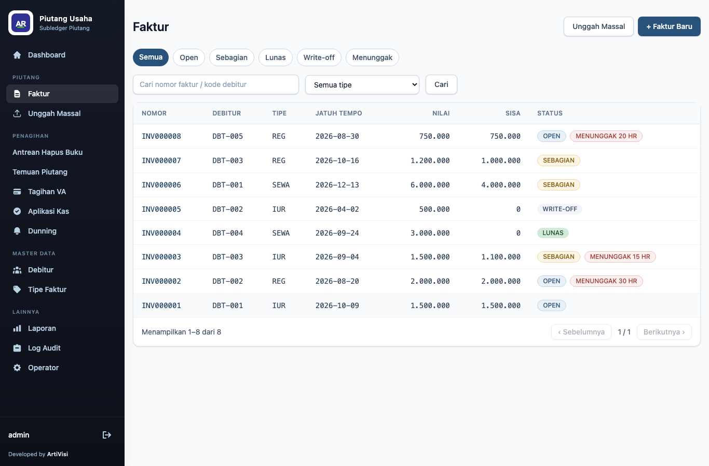
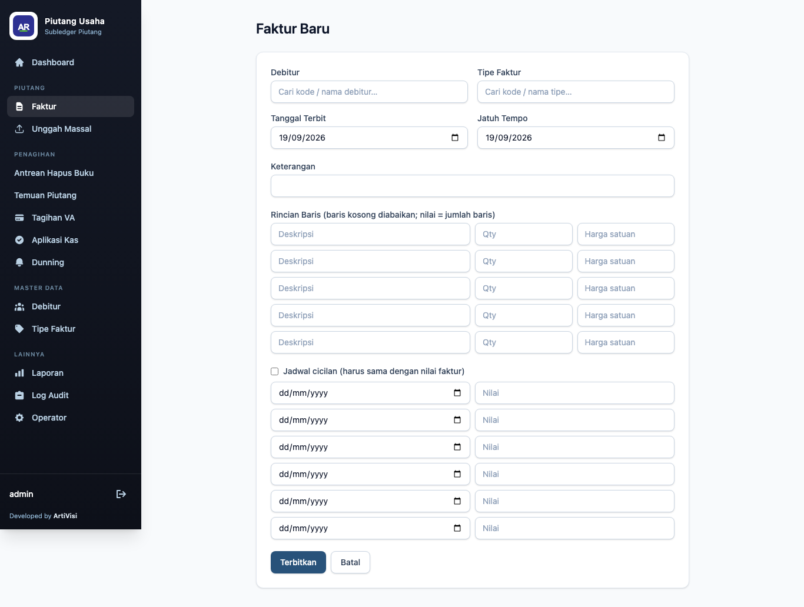
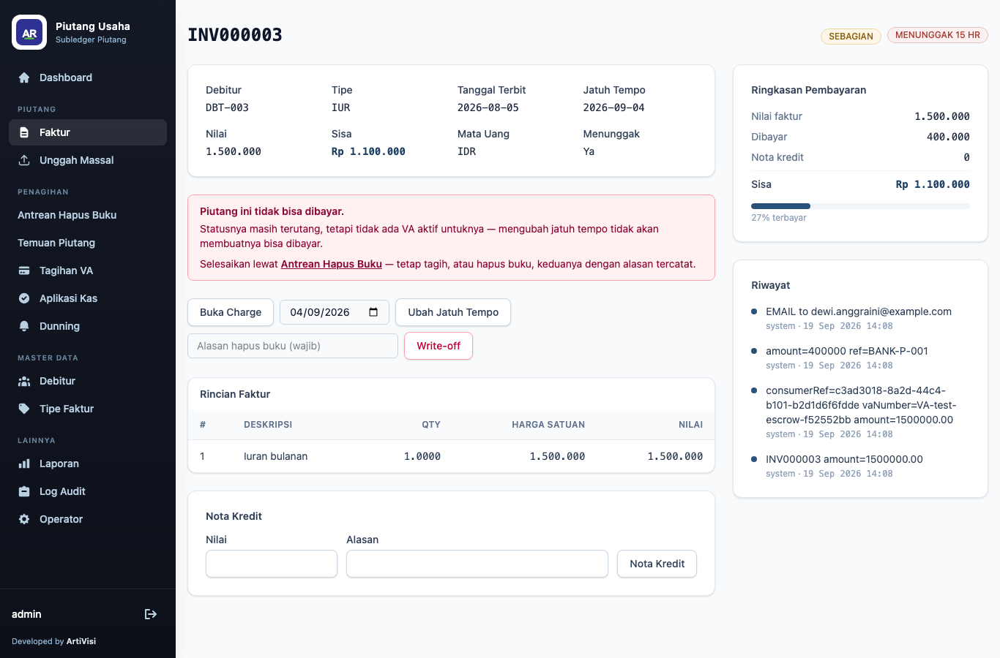
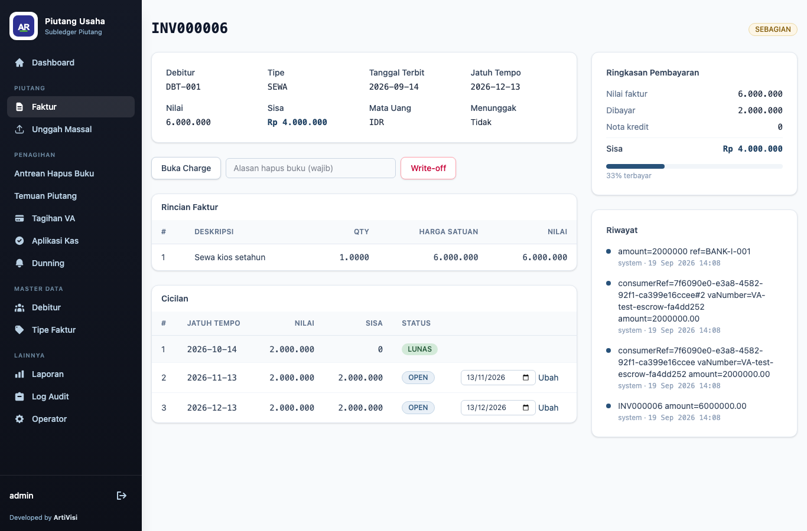
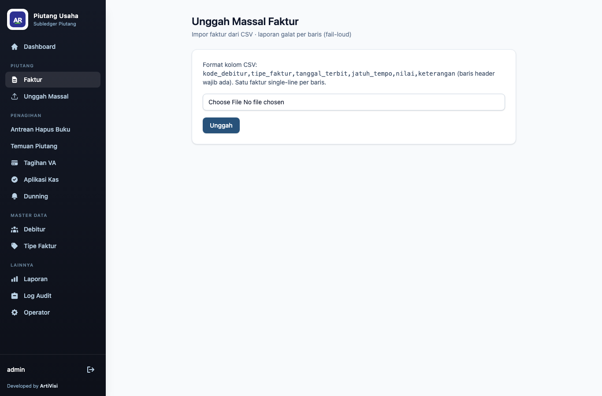

# 3. Faktur & Siklus Piutang

## Daftar faktur

Menu **Invoices** menampilkan seluruh faktur: nomor, debitur, tipe, jatuh tempo, nilai, sisa
(*outstanding*), dan status pembayaran. Faktur yang menunggak diberi badge **overdue** di kolom Due.



Status pembayaran (`paymentStatus`):

| Status | Arti |
|--------|------|
| `OPEN` | belum ada pembayaran |
| `PARTIALLY_PAID` | sebagian terbayar, masih ada sisa |
| `PAID` | lunas |
| `WRITTEN_OFF` | dihapusbukukan |

Klik nomor faktur untuk membuka detail.

## Menerbitkan faktur

Klik **Issue invoice**. Pilih debitur dan tipe (hanya yang aktif), tanggal terbit dan jatuh tempo,
lalu isi baris item. **Nilai faktur = jumlah seluruh baris** (tidak diinput langsung). Baris kosong
diabaikan.



Untuk piutang cicilan, centang **Installment schedule** dan isi tanggal & nominal tiap cicilan —
**total cicilan harus sama dengan nilai faktur**. Setelah tersimpan, aplikasi mengarahkan ke halaman
detail faktur.

Nilai faktur yang sudah terbit bersifat **immutable** — koreksi dilakukan lewat **nota kredit**,
bukan dengan mengubah faktur.

## Detail faktur

Halaman detail merangkum faktur, baris item, jadwal cicilan (bila ada), dan formulir nota kredit.



Contoh INV000003: nilai 1.500.000, telah dibayar 400.000 sehingga *outstanding* 1.100.000, status
`PARTIALLY_PAID`, dan **Overdue: yes**.

Tindakan yang tersedia di detail:

| Tombol / bagian | Aksi |
|-----------------|------|
| **Open charge** | membuka charge di gateway untuk menagih faktur (non-cicilan) |
| **Ubah Jatuh Tempo** | memindahkan tanggal jatuh tempo (non-cicilan) dan meneruskannya ke gateway |
| **Write off** | menghapusbukukan faktur penuh → status `WRITTEN_OFF` |
| **Issue credit note** | menerbitkan nota kredit sebesar nominal tertentu, mengurangi outstanding |

Write-off selalu untuk **satu faktur penuh** (perubahan `paymentStatus`), bukan dokumen bernilai
sebagian.

### Pembayar datang setelah lewat jatuh tempo

Masa berlaku bersifat **lunak**: lewatnya jatuh tempo tidak pernah menggugurkan utang. Faktur tetap
`OPEN` dengan sisa penuh — yang berhenti hanyalah nomor VA-nya, karena *sweep* menariknya agar nomor
itu bisa dipakai tagihan berikutnya. Jadi tidak ada status yang perlu dipulihkan; **yang dipindahkan
hanya tanggalnya**.

Isi tanggal baru pada kolom di sebelah tombol **Ubah Jatuh Tempo**, lalu simpan. Bila charge-nya
masih ada, gateway sekaligus **mengaktifkan kembali VA yang sudah ditarik**, dan pembayar dapat
langsung membayar ke nomor yang sama.

> **Urutannya penting bila charge belum pernah dibuka.** Ubah jatuh tempo **dulu**, baru
> **Buka Charge**. Charge lahir dengan masa berlaku *jatuh tempo + 1 hari*, sehingga membuka charge
> saat tanggalnya masih lampau menghasilkan charge yang langsung kedaluwarsa dan VA-nya kembali
> ditarik. Bila terlanjur terbalik, jalankan **Ubah Jatuh Tempo** sesudahnya — VA akan dipulihkan.

Gateway menolak pemindahan bila nomor VA tersebut sudah dipakai charge lain yang masih aktif. Dalam
hal itu seluruh perubahan dibatalkan, sehingga tanggal di buku AR tidak pernah mendahului apa yang
dilihat pembayar.

## Faktur cicilan

Faktur cicilan menampilkan tabel **Installments**: nomor urut, jatuh tempo, nominal, sisa, status,
serta tombol **Open charge** dan **Ubah** (jatuh tempo) per cicilan. Setiap cicilan ditagih dengan
satu charge tersendiri.

Jatuh tempo cicilan diubah **per baris**, bukan di tingkat faktur: satu jadwal punya satu jatuh tempo
per cicilan, sehingga tanggal faktur tidak bisa mewakilinya. Karena itu kolom **Ubah Jatuh Tempo**
tingkat faktur sengaja tidak muncul pada faktur cicilan. Status *overdue* faktur dihitung dari
cicilan tertunggak paling awal, jadi memindahkan cicilan yang terlambat akan ikut memperbarui
penanda tunggakan faktur.



Contoh INV000006: 6.000.000 dibagi 3 cicilan @2.000.000. Cicilan pertama sudah lunas, sehingga faktur
berstatus `PARTIALLY_PAID` dengan sisa 4.000.000.

## Unggah piutang massal (bulk upload)

Untuk membuat banyak faktur sekaligus, gunakan unggah CSV. Kolom CSV (baris header wajib):

```
debtorCode,invoiceTypeCode,issueDate,dueDate,amount,description
```

Satu faktur satu-baris per baris CSV.



Setelah diunggah, aplikasi menampilkan ringkasan hasil: jumlah baris, sukses, dan galat — beserta
rincian baris yang gagal beserta pesannya. Baris yang tidak valid tidak membuat faktur (gagal
*loud* per baris), tidak ada nilai default yang disisipkan.
</content>
