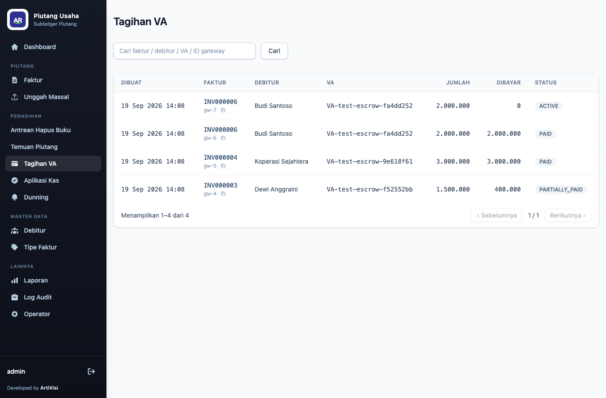
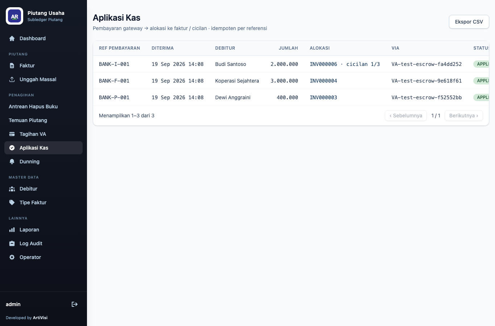

# 4. Penagihan & Pembayaran

AR menagih dengan menjadi **Consumer** dari payment-gateway. Untuk setiap faktur (atau tiap cicilan)
dibuka satu **charge** bertipe `CLOSED`, sehingga webhook pembayaran dapat dipetakan kembali ke
sasarannya lewat `consumerReference` (= id faktur/cicilan) tanpa menebak nominal.

## Alur singkat

1. Dari [detail faktur](03-faktur.md), klik **Buka Charge** (atau pada baris cicilan).
   AR mengirim nomor VA ke gateway dan menyimpan charge. Operasi ini **idempoten** per
   faktur/cicilan — menekan dua kali tidak membuat charge ganda.
2. Saat pembayaran masuk, gateway mengirim **webhook** ke AR. Webhook memicu **aplikasi kas**
   (*cash application*): idempoten pada referensi pembayaran gateway, mengalokasikan ke faktur/cicilan
   sasaran, dan memperbarui `outstanding` + status.

Pembayaran sebagian, lebih, dan kurang ditangani eksplisit; kasus ambigu ditolak *loud*.

## Layar Tagihan VA

Menu **Tagihan VA** menampilkan charge yang telah dibuka di payment-gateway (satu per faktur
single-payment, atau satu per cicilan).

| Kolom | Keterangan |
|-------|------------|
| Dibuat | waktu charge dibuka |
| Faktur | nomor faktur (tautan ke detail faktur); charge cicilan menampilkan ` · cicilan n/m`; id charge di gateway sebagai subteks — dipendekkan 8 karakter dengan tombol salin (id lengkap tersalin ke clipboard) |
| Debitur | nama debitur |
| VA | nomor virtual account |
| Jumlah | nilai charge |
| Dibayar | akumulasi terbayar |
| Status | `ACTIVE`, `PARTIALLY_PAID`, `PAID`, dsb. |

Pencarian mencakup nomor faktur, nama debitur, nomor VA, dan id charge di gateway.

## Layar Aplikasi Kas

Menu **Aplikasi Kas** menampilkan setiap pembayaran gateway yang telah diproses beserta sasaran
alokasinya. Bila ada pembayaran yang belum bisa dialokasikan (`UNAPPLIED` — mis. tidak ada charge
yang cocok, atau kelebihan bayar), banner merah muncul di atas tabel dengan tautan **Tinjau** yang
menyaring tabel ke baris `UNAPPLIED` saja.

| Kolom | Keterangan |
|-------|------------|
| Ref Pembayaran | referensi pembayaran dari bank/gateway (mis. `BANK-P-001`) |
| Diterima | waktu pembayaran diterima |
| Debitur | nama debitur sasaran alokasi; `—` bila belum teralokasi |
| Jumlah | nominal pembayaran |
| Alokasi | faktur/cicilan sasaran (tautan ke detail faktur), atau "— tanpa alokasi —" bila belum teralokasi |
| Via | nomor virtual account terkait |
| Status | `APPLIED` (diterapkan), `SEBAGIAN` (`PARTIALLY_APPLIED`), `UNAPPLIED` (diparkir), atau `REVERSED` (dibalik) |

Pada data contoh: pembayaran 400.000 (`BANK-P-001`) menerapkan sebagian ke INV000003; 3.000.000
(`BANK-F-001`) melunasi INV000004; 2.000.000 (`BANK-I-001`) melunasi cicilan pertama INV000006 —
semuanya `APPLIED`.

Prinsip: **uang tidak pernah hilang.** Aplikasi kas idempoten pada referensi pembayaran gateway;
pembayaran yang sama yang dikirim ulang tidak diterapkan dua kali.
</content>

## Antrean Hapus Buku

Menu **Antrean Hapus Buku** mengumpulkan piutang yang **masih tercatat terutang tetapi sudah tidak
ada yang bisa membayarnya**. Dua kejadian bisa memasukkan satu baris ke sini, dan keduanya
pertanyaan yang berbeda:

- **VA-nya ditutup.** Charge-nya dibatalkan — biasanya karena tagihan pengganti mengambil alih nomor
  VA itu — sehingga tidak ada nomor yang menjawab bila debitur mencoba membayar.
- **Tagihannya ditarik sistem penagih.** Aplikasi yang menerbitkan tagihan melaporkan tagihannya
  dihapus atau diganti. Ditandai **Ditarik sistem penagih** pada kolom Bukti.

Keduanya **tidak** mengubah status faktur. Piutangnya tetap `OPEN` dengan sisa penuh, karena
"tidak bisa ditagih" dan "utangnya dibebaskan" adalah dua pernyataan berbeda — dan hanya orang yang
boleh menyatakan yang kedua.

### Kolom Bukti berisi bukti, bukan kesimpulan

| Label | Artinya |
|-------|---------|
| **Mungkin sudah lunas** | ada charge lain pada nomor VA yang sama yang sudah lunas. **Cocokkan dulu** — nomor VA dipakai ulang antar periode, jadi pembayaran itu bisa saja milik tagihan bulan lain |
| **Belum pernah ditagih** | tidak pernah ada charge sama sekali, jadi tidak ada jejak penagihan maupun pembayaran yang bisa dibandingkan. Kosongnya jejak bukan bukti utangnya tidak ada |
| **Tidak bisa ditagih** | semua charge-nya mati dan tidak ada uang masuk di manapun |

Baris juga menampilkan nomor VA, alasan penarikan dari sumber, dan peringatan bila ternyata sudah
ada alokasi kas pada faktur tersebut.

> **Jangan percayai satu label saja.** Pada 2026-08-18 satu angsuran UKT bulanan tampak persis
> seperti kandidat hapus buku: rail yang menyatakannya ditarik ternyata juga mencatat angsuran
> sebelumnya sebagai belum dibayar, padahal gateway *dan* AR sama-sama mencatatnya lunas penuh.
> Label **Mungkin sudah lunas** memang berbunyi "mungkin" karena alasan ini.

### Dua keputusan, keduanya wajib beralasan

| Tombol | Akibat |
|--------|--------|
| **Tetap tagih** | baris hilang dari antrean, piutangnya utuh. Untuk piutang yang memang masih ditagih lewat jalur lain |
| **Hapus buku** | faktur menjadi `WRITTEN_OFF`, sisa menjadi nol, dan charge di gateway dibatalkan |

Alasan wajib pada keduanya: keputusan yang tidak dicatat tidak bisa ditinjau ulang. Keduanya
tercatat di **Riwayat** faktur dan di log audit.

Baris yang sudah ditandai **Tetap tagih** disembunyikan sampai ada bukti baru — bila kemudian sistem
penagih menarik tagihannya, baris itu muncul kembali, karena keputusan tadi diambil atas bukti yang
sudah berubah.

### Yang sengaja tidak muncul di sini

Antrean hanya memuat kejadian yang **benar-benar teramati**. Piutang lama hasil migrasi tidak punya
catatan kapan VA-nya ditutup, sehingga tidak ikut masuk — membersihkan riwayat delapan tahun adalah
kampanye hapus buku tersendiri yang dipandu [laporan penyisihan](06-laporan.md), bukan pekerjaan
harian. Tidak ada tombol hapus buku massal di halaman ini, dan itu disengaja.

## Temuan Piutang

Menu **Temuan Piutang** memuat kesalahan pada piutang yang **hanya terlihat dari luar buku ini**:
laporan transaksi bank, rekonsiliasi rekening, atau pemeriksaan yang membandingkan dua sistem. Di AR
sendiri faktur tersebut tampak wajar. Karena itu jumlah temuan yang belum diputuskan diumumkan di
**Dashboard**, dan setiap faktur yang memiliki temuan menampilkan peringatan di halaman detailnya.

Setiap baris menampilkan faktur, debitur, sisa piutang, jenis temuan, sumber pelapor, lama temuan
menunggu, serta kolom **Bukti Bank**: referensi, nominal, waktu, nomor VA, dan bank.

| Jenis temuan | Artinya |
|--------------|---------|
| **Diterima bank, belum dibukukan** | bank mencatat pembayaran untuk faktur ini, tetapi tidak ada aplikasi kas yang membukukannya. Debitur masih tampak berutang atas uang yang sudah dibayar |
| **Tercatat lunas, dana belum masuk** | pembayaran tercatat di sini, tetapi dananya tidak ditemukan di rekening penampung |

### Catat pembayaran

Tombol **Catat pembayaran** muncul hanya pada temuan *Diterima bank, belum dibukukan* yang bukti
bank-nya lengkap. Nominal, waktu, dan nomor VA diambil dari temuan, sehingga tidak ada angka yang
diketik ulang. Cocokkan dulu referensinya dengan laporan bank, lalu isi catatan pemeriksaan.

Setelah dicatat:

- aplikasi kas baru tercatat dengan referensi bank sebagai kuncinya, dan sisa faktur berkurang;
- aplikasi penagih menerima kabar pembayaran, sehingga status debitur di sana ikut diperbarui;
- debitur **tidak** menerima email tanda terima, karena pembayarannya sudah lama terjadi;
- temuan ditutup dengan keputusan `PAYMENT_BOOKED` beserta nama pencatatnya.

Pencatatan ditolak, dengan alasannya tertulis di layar, bila:

- referensi bank tersebut sudah tercatat sebagai aplikasi kas, termasuk di faktur lain;
- faktur sudah lunas, dihapus buku, atau dibatalkan;
- nominal temuan melebihi sisa faktur. Selisihnya perlu diputuskan terlebih dahulu;
- bukti bank belum lengkap.

### Menutup temuan tanpa pembukuan

Untuk temuan yang tidak memerlukan pembukuan, pilih keputusan dan tulis alasannya:

| Keputusan | Kapan digunakan |
|-----------|-----------------|
| **Sudah tercatat di tempat lain** | pembayarannya sudah dibukukan, misalnya dengan referensi yang berbeda |
| **Dana dikembalikan ke pembayar** | uangnya sudah dikembalikan |
| **Transaksi dibatalkan bank** | bank membatalkan atau mengoreksi transaksi tersebut |
| **Pembayaran milik piutang lain** | uangnya untuk faktur lain |
| **Lainnya, jelaskan di catatan** | alasan lain, dijelaskan pada catatan |

Setiap keputusan tercatat di log audit dan di **Riwayat** faktur. Temuan yang sudah ditutup tetap
tersimpan, sehingga debitur yang pembayarannya berulang kali tertinggal dapat dikenali.
