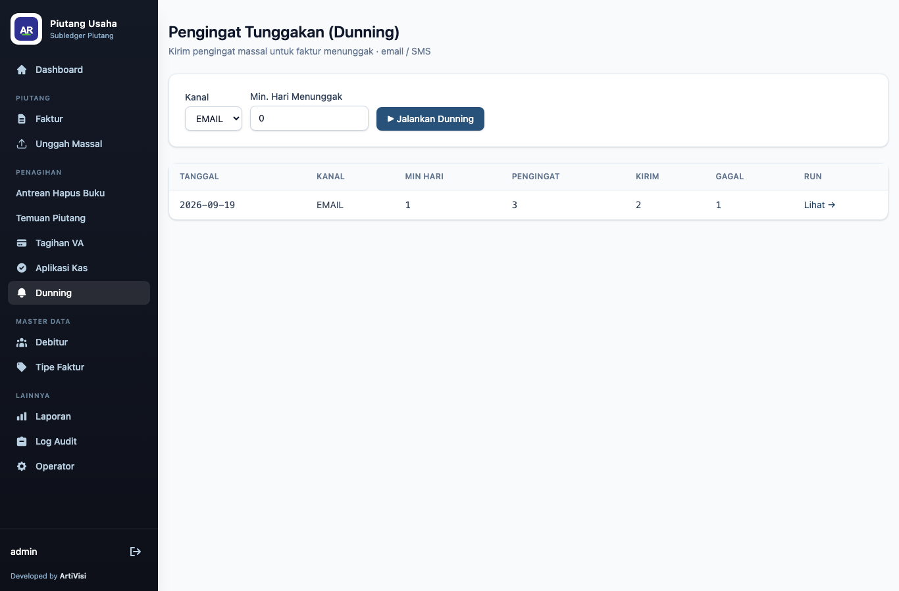
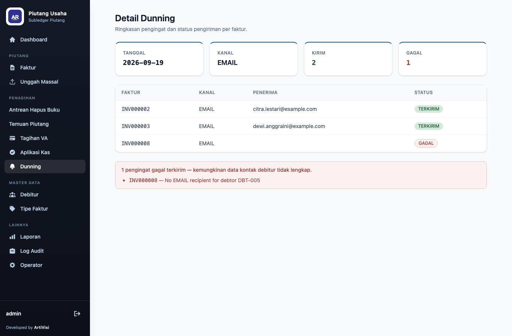

# 5. Pengingat Tunggakan (Dunning)

Dunning mengirim pengingat untuk faktur yang menunggak. Menu **Dunning** menampilkan formulir untuk
menjalankan pengingat dan riwayat setiap *run*.

## Menjalankan dunning

Pada formulir:

| Kolom | Keterangan |
|-------|------------|
| Channel | kanal pengingat: `EMAIL` atau `SMS` |
| Min days overdue | ambang minimum hari menunggak agar faktur ikut diproses |

Klik **Run dunning**. Aplikasi memilih seluruh faktur dengan sisa tagihan yang menunggak melewati
ambang, menyusun pengingat per faktur, lalu mengarahkan ke halaman detail run.

Kanal bersifat *pluggable*. Kanal EMAIL memakai *outbox* (pengiriman yang gagal diulang). Kanal SMS
hanya aktif bila dikonfigurasi; bila diminta tanpa konfigurasi, run gagal *loud*.

## Detail run

Detail run menampilkan ringkasan (tanggal, kanal, jumlah terkirim, jumlah galat) dan satu baris per
pengingat.

Pada data contoh (kanal EMAIL, minimal 1 hari menunggak):

| Faktur | Penerima | Status | Error |
|--------|----------|--------|-------|
| INV000002 | citra.lestari@example.com | SENT | — |
| INV000003 | dewi.anggraini@example.com | SENT | — |
| INV000008 | *(kosong)* | ERROR | No EMAIL recipient for debtor DBT-005 |

INV000008 milik DBT-005 yang tidak memiliki email, sehingga pengingatnya **gagal eksplisit** dengan
pesan jelas — bukan dilewati diam-diam dan bukan memakai penerima default. Ringkasan mencatat
**Sent: 2, Errors: 1**.
</content>
