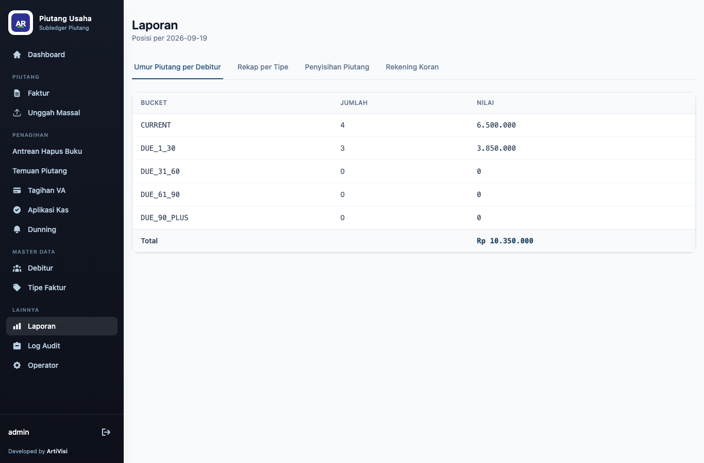
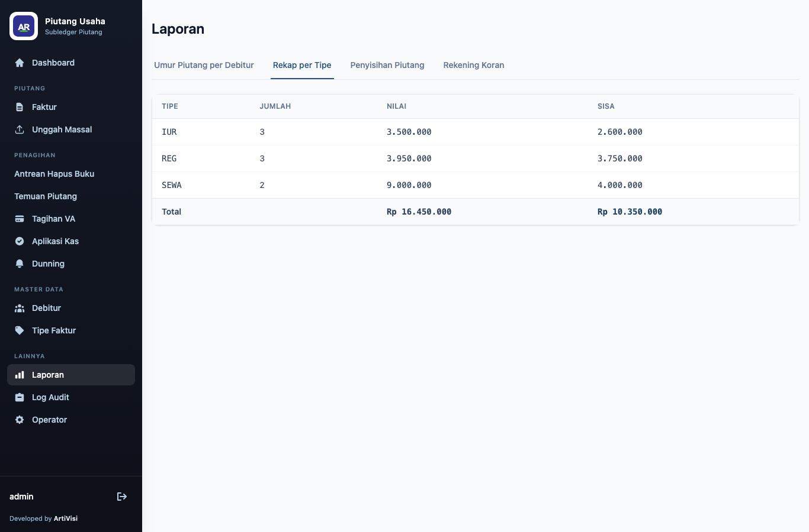
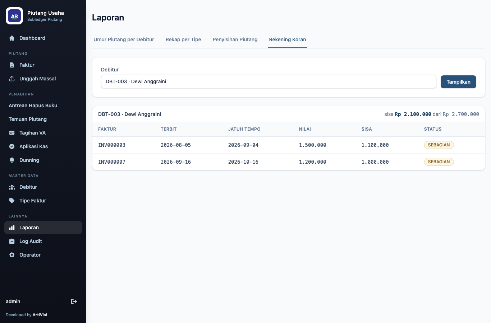

# 6. Laporan

Menu **Reports** memuat tiga laporan yang saling tertaut lewat pranala di bagian atas: **Aging**,
**Recap**, dan **Statement**.

## Umur piutang (Aging)

Rekap sisa tagihan per *bucket* umur, dengan jumlah kewajiban dan total keseluruhan.

Bucket mengikuti aturan yang sama dengan [dashboard](01-pendahuluan-dan-navigasi.md#dashboard-umur-piutang):
`CURRENT`, `DUE_1_30`, `DUE_31_60`, `DUE_61_90`, `DUE_90_PLUS`. Baris **Total** menunjukkan total
outstanding seluruh piutang.

## Rekap per tipe faktur (Recap)

Ringkasan piutang dikelompokkan per tipe faktur: jumlah faktur, total nilai, dan total outstanding,
ditutup baris **Total**.

Laporan ini menjawab "berapa yang ditagih dan berapa yang belum tertagih per kategori piutang".

## Rekening koran debitur (Statement)

Pilih debitur pada dropdown lalu klik **Show** untuk menampilkan seluruh faktur debitur tersebut
beserta saldo.

Contoh DBT-003 (Dewi Anggraini): INV000003 (outstanding 1.100.000, `PARTIALLY_PAID`) dan INV000007
(outstanding 1.000.000 setelah nota kredit, `PARTIALLY_PAID`). Header menampilkan **outstanding
2.100.000 of 2.700.000** — sisa tagihan terhadap total nilai faktur debitur.
</content>
