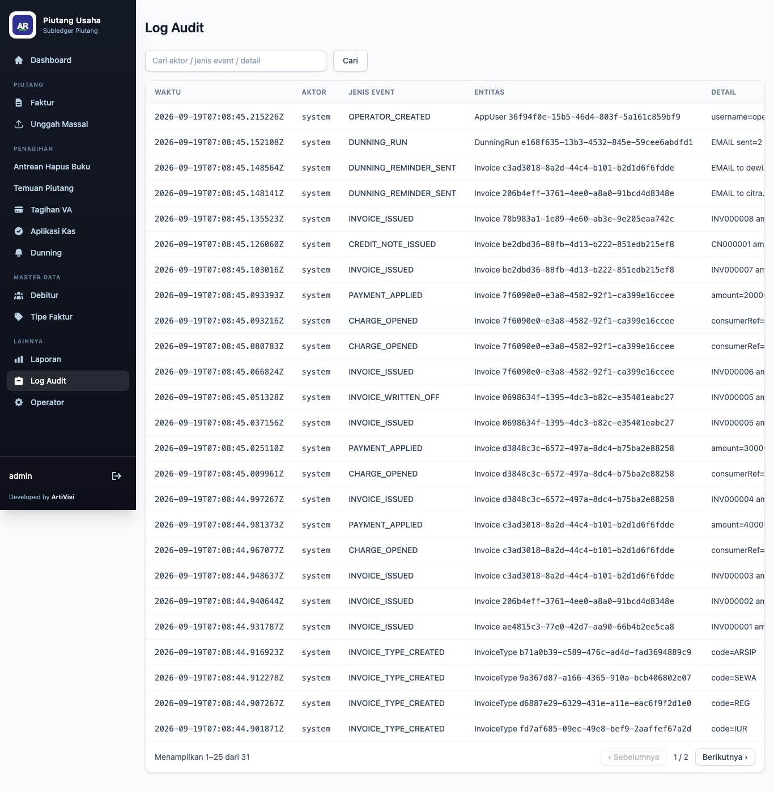
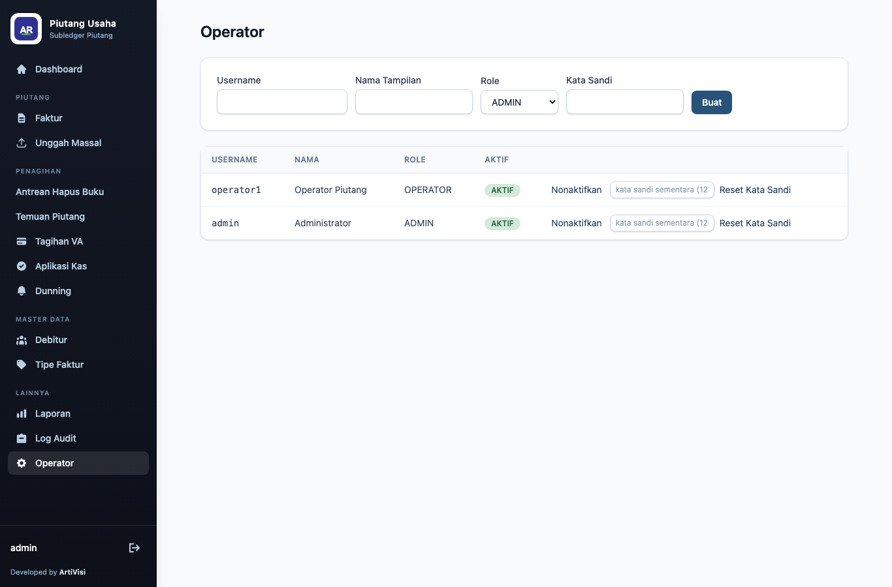

# 7. Audit & Operator

## Log audit

Menu **Audit** mencatat setiap tindakan penting pada sistem: kapan, oleh siapa, jenis peristiwa,
entitas terkait, dan rincian.

| Kolom | Keterangan |
|-------|------------|
| When | waktu peristiwa |
| Actor | pengguna pelaku |
| Event | jenis peristiwa (mis. `INVOICE_ISSUED`, `INVOICE_WRITTEN_OFF`) |
| Entity | entitas dan id yang terpengaruh |
| Detail | rincian tambahan |

Log audit bersifat hanya-baca dan menjadi jejak tak terbantahkan untuk penerbitan faktur,
hapus buku, pembayaran, dan tindakan lain.

## Operator (manajemen pengguna)

Menu **Operators** (khusus peran **ADMIN**) mengelola pengguna aplikasi.

### Menambah operator

Isi formulir di bagian atas:

| Kolom | Keterangan |
|-------|------------|
| Username | nama pengguna unik untuk login |
| Display name | nama tampilan |
| Role | `ADMIN` atau `OPERATOR` |
| Password | kata sandi awal |

Klik **Create**. Pengguna baru muncul di tabel.

### Mengaktifkan / menonaktifkan

Kolom **Enabled** menampilkan status akun. Tombol **Disable/Enable** pada setiap baris mengubah
status: pengguna yang dinonaktifkan tidak dapat login, tanpa perlu menghapus akunnya. Pengguna admin
awal (`admin`) berasal dari konfigurasi dan selalu ada saat aplikasi pertama dijalankan.
</content>
